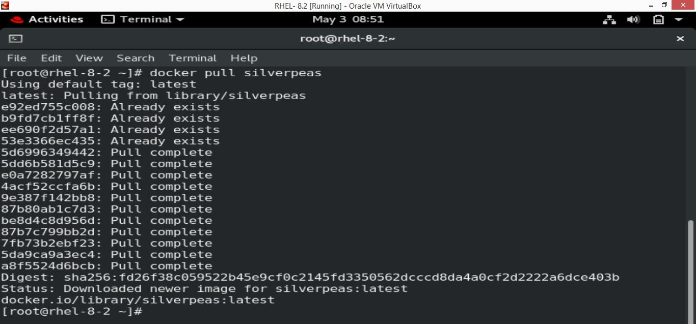

# IIEC Rise 1.0 Project on Silverpeas with PostgreSQL using Docker Compose

As part of the **[IIEC Rise 1.0](https://www.youtube.com/watch?v=3Kn6_b-1mK4&list=PLAi9X1uG6jZ30QGz7FZ55A27jPeY8EwkE)** initiative by **[Mr. Vimal Daga](https://www.linkedin.com/in/vimaldaga/)** i have completed my training on **Docker**. This project is the consolidated learning along with its implementation at one place. I have used the **multi-tier architecture** having different OS for different purpose.  


- **Application:** Silverpeas (built on Java).  
- **Database:** PostgreSQL.  
- **Server:** WildFly (formerly known as **JBoss**).  


**Concepts used**
- **Networking - Port Address Translation (PAT)**
- **Persistent Storage**
- **Image Entry Point**
- **Infrastructure Automation**
- **Docker-Compose**
- **Identify containers based on HOSTNAME**

**1. Pre-requisites:**  
Any Linux OS which runs docker software. I have used **Red Hat Enterprise Linux RHEL-8** for my project.  
Install docker-compose following the link - https://docs.docker.com/compose/install/#install-compose-on-linux-systems.  
Check docker-compsose is installed by running command ```docker-compose version```  


**2. Initaiation**  
Start the docker service by running command ```systemctl start docker```  


Enable the docker service to start automatically with startup. Use the below command,  
```systemctl enable docker```


**3. Images**  
  
**Silverpeas:**  
.  
Download silverpeas image using docker pull silverpeas. This command will pull the latest version of silverpeas from https://hub.docker.com/_/silverpeas  


**PostgreSQL:**  
a. Silverpeas requires an open-source, powerful database like PostgreSQL which is recommended.  
b. Download postgresql image using command ```docker pull postgres:9.6```. This command will pull the version.9.6
of postgresql from https://hub.docker.com/_/postgres  


**4. Setting up PostgreSQL:**  
Use below command  
```docker run --name postgresql -it -e POSTGRES_PASSWORD="thesilverpeaspassword" -e POSTGRES_USER="silverpeas" -e POSTGRES_DB="Silverpeas" -v postgresql-data:var/lib/postgresql/data postgresql:9.6```  

  While launching container from image PostgreSQL will run a script internally to pick variables passed and use them. This concept is called the **ENTRY POINT**. Inorder to pass variable to another shell in different operating system we use the argument "-e". Here we have passed three arguments ```POSTGRES_PASSWORD```, ```POSTGRES_USER``` and ```POSTGRES_DB```.


**Note:**  
In networking its not a good practice to use the IP address to idenfity the container as it changes randomly. As part of best practices to identify containers, we have utilized the **HOST NAME** of containers which is unique. 

In above command the Database name is "Silverpeas" first alphabet is in upper case.  


The argument --name is container name and here the name of container is ```postgresql```.  

The argument -v is the volume and it is mapped to path in base OS (RHEL-8.2). At times when container crashes due to some reason, all the data related to client will be list. Inorder to handle this situation we have Persistent volumes in docker. These are volumes mapped to BaseOS (in my case RHEL - 8.2) and with this even if the container crashes, automatically another container will start and this new container can be mapped to this volume and continue using its data without any loss.  


**5. Setting up Silverpeas**  
Make sure the PostgreSQL is running before starting silverpeas. Run command ```docker ps``` to view the running containers.  


Run below command to start the silverpeas:  
```docker run --name silverpeas -p 8080:8000 -d   -e DB_NAME="Silverpeas"    -e DB_USER="silverpeas"   -e DB_PASSWORD="thesilverpeaspassword"  -v silverpeas-log:/opt/silverpeas/log  -v silverpeas-data:/opt/silverpeas/data  --link postgresql:database  silverpeas```

- Silverpeas application runs on port 8000. Using the concept of **Port Address Translation** we have configured the container in such a way that any request coming to container on port *8080* would be routing the *network traffic* to port *8000*. **IPTables** are the program which make this PAT or NAT possible using the technology from baseOS which in this case is RHEL-8.2  

- Here we have used two different **Persistent Volumes** one for logs and another for data. These can be handy while backtracking the issues in production environments when client faces any issues.  

In the above docker command the argument **--link** would link silverpeas container with postgresql container.  

- To connect to PostgreSQL we need a client. Run below command to install pgdg.  
https://download.postgresql.org/pub/repos/yum/10/redhat/rhel-7-x86_64/pgdg-redhat-repo-42.0-11.noarch.rpm
After installation use below commands to access database:  
```docker exec -it postgresql bash```
When we need to run a program inside container we run above docker exec command and pass program name as argument.
Here we are running bash inside postgresql (container name).

Execute ```psql -h $HOSTNAME -U silverpeas -W``` and type the password on prompt and run ```\du``` to get list of users. Type exit to return back to base OS.  


**6. Login to silverpeas**  
After launching wait for sometime for the services to run and then navigate to url.  
Use below login credentials to login as Administrator account.  
**URL:  http://localhost:8080/silverpeas**  
**Username: SilverAdmin**  
**Password: SilverAdmin**  
  


Click on **Login**  
  


By default the lanugae is French. After tweaking with Admin settings and changing language to English, we have below  
  

Finally the Silverpeas dashboard in English version.  
  


**7. Infrastructure Automation**
So far the above process is manual and unmanageable. There is lot of scope for human error and time taking process.
image here from notes.  

The above complete infrastructure (from pulling image from docker hub, creating containers and managing them) can be automated using program. THis concept of creating a complete infrastriucture fusing code or program is called Infrastructure as Code.
In docker world we have **DOCKER-COMPOSE**, a tool for definining and running multi-container applications. This [YAML](https://yaml.org/) file could be used to define services netwoorks and volumes for Docker applciations. 

Access the **docker-compose.yml** file and download to local machine. Use vim docker-compose.yml and you can see the compose file as below.

  

  


*Components in Docker-Compose*.  
**Version:** Version of the compsoe to be used. I have used version 3 of docker compose.  

**Services:**
Here we list out the services to be used while starting the docker-compose file.  

**Image:**
Name of the image in dockerhub.  

**Container_name:**
Specify a unique name to identify containers.  

**restart:**
When set to ```always``` docker-compose will automatically restart incase of container crash or if container stops working.  


**depends_on:**
Silverpeas depends on PostgreSQL for its data storage. Due to this dependency, Silverpeas has to wait till the PostgreSQL is up and running.  

**environment:**
Mention the environment variables to pass to thhe image. Here in PostgreSQL we have passed POSTGRES_PASSWORD, POSTGRES_USER and POSTGRES_DB as arugments to image.

**volumes:**
Data stored in containers is volatile which means we lose the data when the container stops running. In order to make this data permanent we create volumes in docker and map them to local drive. Here a volume gets created by name postgresql-data and will store the postgresql data at /var/lib/postgresql/data. This conecpt is called the persistent volumes.


Start the docker compose in detached mode.    
``` docker-compose up -d```.  
  

Run below command to check logs of Silverpeas.  
```docker logs silverpeas```.  

   


Now access site using  
 

Stop containers by running below command 
```docker-compose down``` 
  
This command will stop the running containers, remove those containers and networks created.
